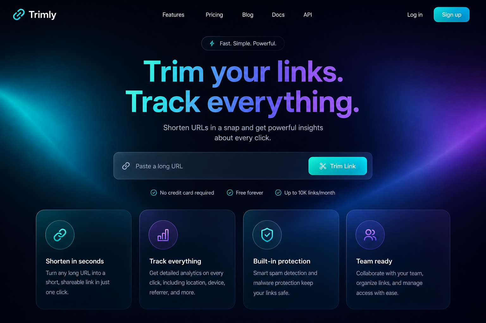
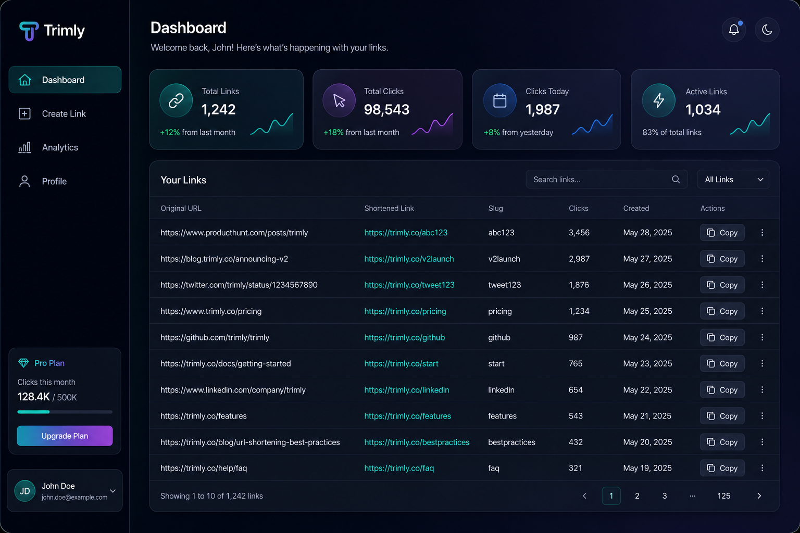
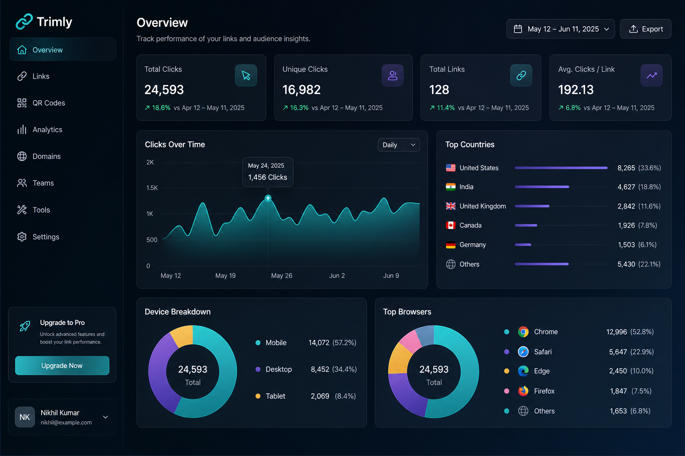
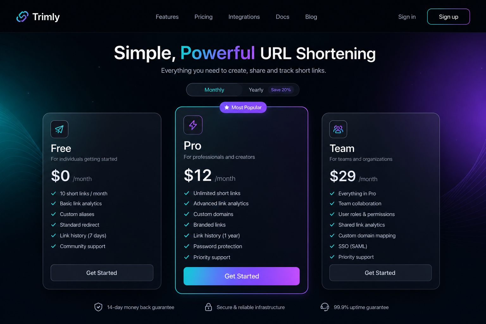

# Trimly

<div align="center">

**Trim your links. Track everything.**

A production-ready URL shortener SaaS with analytics, QR codes, password protection, and an admin panel.

[](https://trimly-url-shortener.vercel.app)
[](LICENSE)
[](https://nextjs.org)
[](https://www.typescriptlang.org)

**[Live App](https://trimly-url-shortener.vercel.app)** · **[Report Bug](https://github.com/AnujSingh0212U/trimly/issues)** · **[Request Feature](https://github.com/AnujSingh0212U/trimly/issues)**

</div>

---

## Overview

**Trimly** is a full-stack URL shortening platform built like a real SaaS product — not a demo. Shorten links, track every click with deep analytics, generate QR codes, protect links with passwords, and manage everything from a beautiful glassmorphism dashboard.

| | |
|---|---|
| **Owner** | [Anuj Singh](https://github.com/AnujSingh0212U) |
| **Email** | singhanuj112411@gmail.com |
| **Live URL** | [trimly-url-shortener.vercel.app](https://trimly-url-shortener.vercel.app) |
| **Stack** | Next.js 15 · PostgreSQL · Prisma · Clerk · Tailwind · Framer Motion |

---

## Screenshots

### Landing Page
<p align="center">
  
</p>

### Dashboard
<p align="center">
  
</p>

### Analytics
<p align="center">
  
</p>

### Pricing
<p align="center">
  
</p>

---

## Features

- **Guest & authenticated** URL shortening
- **Custom slugs** with collision detection and reserved-word blocking
- **QR code** generation (PNG / SVG)
- **Click analytics** — geo, device, browser, OS, referrer, UTM
- **Password-protected** links with expiration and max-click limits
- **Admin panel** — user management, link moderation, platform stats
- **Dark / light mode** with glassmorphism UI
- **REST API** with standardized response envelope
- **Rate limiting**, input validation, security headers

---

## Tech Stack

| Layer | Technology |
|-------|------------|
| Frontend | Next.js 15, React 19, TypeScript, Tailwind CSS v4 |
| UI | Shadcn UI, Framer Motion, Lucide Icons, Recharts |
| Backend | Next.js API Routes |
| Database | PostgreSQL, Prisma ORM |
| Auth | Clerk |
| State | TanStack React Query, Zustand |
| Testing | Vitest, Playwright |
| Deploy | Vercel + Railway/Supabase |

---

## Quick Start

### Prerequisites

- Node.js 20+
- PostgreSQL (local, [Railway](https://railway.app), or [Supabase](https://supabase.com))
- [Clerk](https://clerk.com) account

### Installation

```bash
git clone https://github.com/AnujSingh0212U/trimly.git
cd trimly
npm install

cp .env.example .env
# Edit .env with your credentials

npm run db:push
npm run db:seed
npm run dev
```

Open [http://localhost:3000](http://localhost:3000).

### Environment Variables

| Variable | Required | Description |
|----------|----------|-------------|
| `DATABASE_URL` | Yes | PostgreSQL connection string |
| `DIRECT_URL` | Yes | Direct PostgreSQL URL for migrations |
| `NEXT_PUBLIC_CLERK_PUBLISHABLE_KEY` | Yes | Clerk publishable key |
| `CLERK_SECRET_KEY` | Yes | Clerk secret key |
| `CLERK_WEBHOOK_SECRET` | Yes | Clerk webhook signing secret |
| `NEXT_PUBLIC_APP_URL` | Yes | App URL (e.g. `http://localhost:3000`) |
| `UPSTASH_REDIS_REST_URL` | No | Redis for distributed rate limiting |
| `UPSTASH_REDIS_REST_TOKEN` | No | Upstash Redis token |

---

## API Reference

| Method | Endpoint | Auth | Description |
|--------|----------|------|-------------|
| `POST` | `/api/shorten` | Optional | Create short URL |
| `GET` | `/:slug` | None | Redirect + track click |
| `GET` | `/api/url` | User | List URLs (paginated) |
| `PUT` | `/api/url/:id` | User | Update URL |
| `DELETE` | `/api/url/:id` | User | Delete URL |
| `GET` | `/api/analytics/:id` | User | URL analytics |
| `GET` | `/api/dashboard` | User | Dashboard stats |
| `GET` | `/api/profile` | User | User profile |
| `GET` | `/api/admin` | Admin | Platform stats |

Full docs: [`docs/API.md`](docs/API.md) · Architecture: [`docs/ARCHITECTURE.md`](docs/ARCHITECTURE.md)

---

## Project Structure

```
trimly/
├── app/              # Pages, API routes, middleware
├── components/       # UI, dashboard, marketing, layout
├── hooks/            # React Query hooks
├── services/         # Business logic
├── repositories/     # Prisma data access
├── lib/              # Validators, security, utilities
├── prisma/           # Schema, migrations, seed
├── tests/            # Unit & E2E tests
├── docs/             # Documentation
└── public/           # Static assets & screenshots
```

---

## Scripts

```bash
npm run dev          # Development server
npm run build        # Production build
npm run start        # Start production server
npm run db:push      # Push schema to database
npm run db:migrate   # Run migrations
npm run db:seed      # Seed database
npm run test         # Unit tests
npm run test:e2e     # E2E tests
npm run lint         # ESLint
```

---

## Deployment

### Vercel

1. Push to GitHub
2. Import repo at [vercel.com/new](https://vercel.com/new)
3. Add environment variables from `.env.example`
4. Deploy

### Database

Create a PostgreSQL instance on Railway or Supabase, then run:

```bash
npm run db:push
```

### Clerk

1. Create app at [clerk.com](https://clerk.com)
2. Set sign-in URL: `/sign-in`, sign-up URL: `/sign-up`
3. Add webhook: `POST https://your-domain.com/api/webhooks/clerk`
4. Copy keys to Vercel env vars

### Admin Access

After signing up, promote your account:

```sql
UPDATE users SET role = 'ADMIN' WHERE email = 'your@email.com';
```

---

## Testing

```bash
npm run test         # 5 unit tests (slug engine, URL sanitizer)
npm run test:e2e     # Playwright E2E (landing, pricing, 404)
```

---

## Author

**Anuj Singh** — [@AnujSingh0212U](https://github.com/AnujSingh0212U) · singhanuj112411@gmail.com

---

## License

MIT © [Anuj Singh](https://github.com/AnujSingh0212U)
